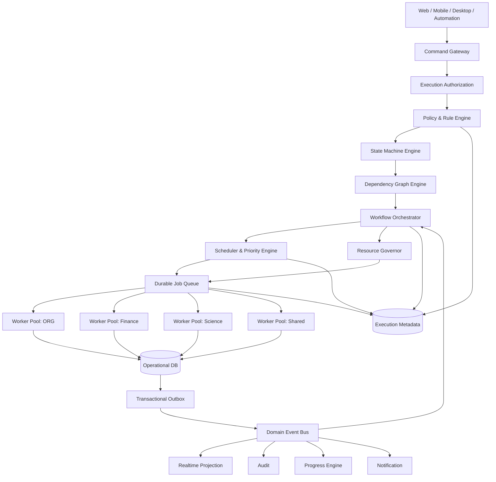
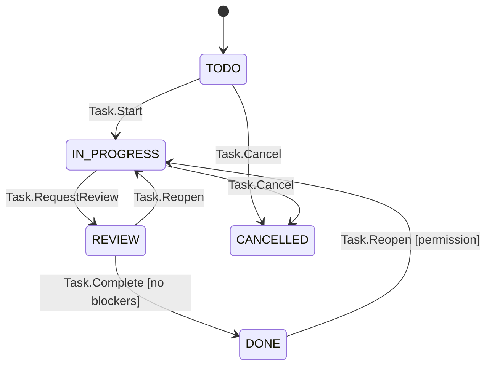
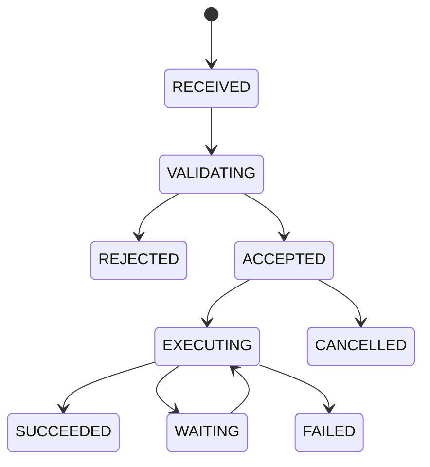
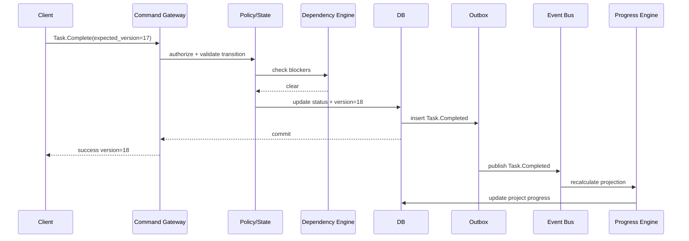
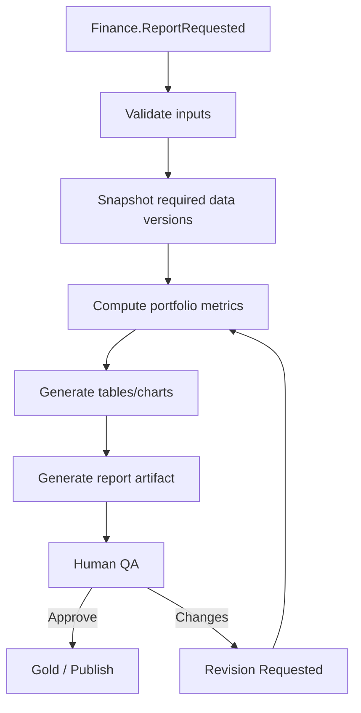
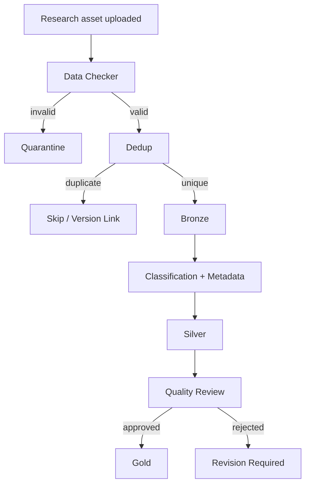

# WORKHUB EXECUTION & ORCHESTRATION ARCHITECTURE
## Engineering Design Specification — Tầng Điều phối & Thực thi v2.0

**Document ID:** WH-EOA-002  
**Phiên bản:** v2.0 — Target Architecture  
**Ngày:** 13/08/2026  
**Phạm vi:** WorkHub ORG · Economics/Finance · Science · Shared Platform Services  
**Trạng thái:** Thiết kế kiến trúc đề xuất trước giai đoạn đóng gói ứng dụng  
**Nguồn baseline:** WorkHub Ecosystem — Kiến trúc chi tiết v1.0; mã nguồn hiện tại của WorkHub-ORG, WorkHub-Fin và WorkHub-Sci.  
**Ngoài phạm vi của phiên bản này:** triển khai Knowledge Learning/Continuous Learning nội bộ, huấn luyện mô hình AI tự động và cơ chế tự ra quyết định bằng AI.

---

## Mục lục

1. [Tóm tắt điều hành](#1-tóm-tắt-điều-hành)
2. [Baseline hiện tại của WorkHub](#2-baseline-hiện-tại-của-workhub)
3. [Vấn đề kiến trúc cần giải quyết](#3-vấn-đề-kiến-trúc-cần-giải-quyết)
4. [Định nghĩa chính thức của tầng mới](#4-định-nghĩa-chính-thức-của-tầng-mới)
5. [Mục tiêu, nguyên tắc và giới hạn](#5-mục-tiêu-nguyên-tắc-và-giới-hạn)
6. [Kiến trúc mục tiêu tổng thể](#6-kiến-trúc-mục-tiêu-tổng-thể)
7. [Mô hình vận hành chuẩn của WorkHub](#7-mô-hình-vận-hành-chuẩn-của-workhub)
8. [Các engine lõi](#8-các-engine-lõi)
9. [Mô hình trạng thái chuẩn](#9-mô-hình-trạng-thái-chuẩn)
10. [Thuật toán vận hành](#10-thuật-toán-vận-hành)
11. [Mô hình dữ liệu cho Execution Layer](#11-mô-hình-dữ-liệu-cho-execution-layer)
12. [Command, Event và API Contract](#12-command-event-và-api-contract)
13. [Event Catalog](#13-event-catalog)
14. [Workflow mẫu cho ORG, Finance và Science](#14-workflow-mẫu-cho-org-finance-và-science)
15. [Tích hợp Web, App và Offline](#15-tích-hợp-web-app-và-offline)
16. [Bảo mật và quyền thực thi](#16-bảo-mật-và-quyền-thực-thi)
17. [Observability, Audit và Telemetry](#17-observability-audit-và-telemetry)
18. [Khả năng chịu lỗi và tự phục hồi](#18-khả-năng-chịu-lỗi-và-tự-phục-hồi)
19. [Testing Architecture](#19-testing-architecture)
20. [Deployment và chiến lược mở rộng](#20-deployment-và-chiến-lược-mở-rộng)
21. [Kế hoạch chuyển đổi từ codebase hiện tại](#21-kế-hoạch-chuyển-đổi-từ-codebase-hiện-tại)
22. [Tiêu chí nghiệm thu](#22-tiêu-chí-nghiệm-thu)
23. [Quyết định kiến trúc quan trọng](#23-quyết-định-kiến-trúc-quan-trọng)
24. [Lộ trình mở rộng về sau](#24-lộ-trình-mở-rộng-về-sau)
25. [Kết luận](#25-kết-luận)
26. [Phụ lục](#26-phụ-lục)

---

# 1. Tóm tắt điều hành

[Certain] WorkHub hiện không còn ở giai đoạn một website CRUD đơn giản. Kiến trúc v1.0 đã có Authentication, Workspace, Business Pipeline, Infrastructure và Storage; Infrastructure đã định nghĩa Data Checker, Deduplication, Queue Manager, Retry Manager, Trace ID, Logging, Monitoring, Backup, Versioning, Soft Delete, Restore, Circuit Breaker và Rate Limiting. Mã nguồn hiện tại cũng đã có nhiều cơ chế vận hành thật như dependency giữa task, chống vòng lặp phụ thuộc, optimistic conflict detection, realtime synchronization, audit log, soft delete, restore, bulk operations và tính lại tiến độ dự án.

[Likely] Bước nâng cấp phù hợp tiếp theo không phải thêm một nhóm chức năng rời rạc. WorkHub cần một **Execution & Orchestration Layer** — tầng chịu trách nhiệm quyết định và điều phối **cách toàn hệ thống vận hành**.

[Likely] Tầng này phải biến WorkHub từ mô hình:

```text
Người dùng -> gọi chức năng -> JavaScript xử lý -> Database
```

thành:

```text
Người dùng / App / API
        ↓
      Command
        ↓
Execution & Orchestration Layer
        ↓
Policy -> State -> Dependency -> Workflow -> Scheduler -> Queue -> Worker
        ↓
      Event Bus
        ↓
Database / Realtime / Audit / Notification / Progress
```

[Likely] Mục tiêu không phải “tự động hóa mọi thứ bằng AI”. Mục tiêu là tạo ra một **bộ máy thực thi deterministic, có luật, có trạng thái, có khả năng phục hồi và có thể quan sát đầy đủ**. AI sau này có thể trở thành một worker hoặc một nguồn đề xuất, nhưng không được trở thành nền móng vận hành của v2.

[Likely] Tên kiến trúc chính thức đề xuất:

> **WorkHub Execution & Orchestration Layer (EOL)**  
> Engine trung tâm: **WorkHub Execution Engine (WEE)**

[Likely] Khi EOL hoàn thành, Web, ứng dụng di động, desktop client, tự động hóa định kỳ và tác vụ backend đều trở thành các client của cùng một bộ luật vận hành. Đây là điều kiện quan trọng để WorkHub có thể phát triển quy mô mà không tạo ra nhiều bản logic khác nhau ở từng ứng dụng.

---

# 2. Baseline hiện tại của WorkHub

## 2.1 Kiến trúc v1.0

[Certain] Tài liệu WorkHub Ecosystem v1.0 định nghĩa 6 tầng:

1. User Layer.
2. Authentication Layer.
3. Workspace Layer.
4. Business Pipeline Layer.
5. Infrastructure Layer.
6. Storage Layer.

[Certain] Economics Workspace được mô tả theo pipeline 7 giai đoạn: thu thập dữ liệu, kiểm tra nguồn, chuẩn hóa, AI Analysis, sinh báo cáo, Human QA và xử lý sau Gold. Science Workspace có pipeline riêng theo Bronze -> Classification/Metadata -> Silver -> Quality Review -> Gold -> Science Storage.

[Certain] Storage hiện dùng mô hình Bronze / Silver / Gold và vòng đời Active / Archive / Trash. Tài liệu cũng đã định nghĩa Soft Delete, Versioning, Restore, Queue, Retry, Circuit Breaker và Observability ở mức kiến trúc.

## 2.2 Audit ba codebase hiện tại

[Certain] Ba codebase được rà soát gồm:

- WorkHub-ORG-main.
- WorkHub-Fin-main.
- WorkHub-Sci-main.

[Certain] Các file chính hiện có quy mô lớn:

| Khu vực | `script.js` | `api.js` | Ghi chú |
|---|---:|---:|---|
| ORG | 6.823 dòng | 1.850 dòng | Có dashboard, task/project, chat, RAG, service worker |
| Finance | 5.082 dòng | 2.312 dòng | Có task/project và domain finance |
| Science | 5.480 dòng | 1.932 dòng | Có task/project, ResearchHub, ResearchTool, journal |

[Certain] Finance và Science chia sẻ 180 tên hàm trong `script.js`; tương đương khoảng 73,8% theo Jaccard và gần 90% số hàm của codebase nhỏ hơn. Cả ba codebase cùng chia sẻ 129 tên hàm. Điều này cho thấy một phần lớn cơ chế nền đang được port/copy giữa workspace thay vì được điều khiển bởi một engine chung.

## 2.3 Những cơ chế vận hành đã tồn tại

[Certain] Mã hiện tại đã có các nền tảng quan trọng sau:

- Trace ID cho mutation và ghi `system_logs`.
- Soft delete, restore và hard delete.
- Project progress được tính lại từ task.
- Task dependency qua `blocked_by`.
- Kiểm tra circular dependency trước khi lưu task.
- Không cho task chuyển `Done` khi blocker chưa hoàn thành.
- Optimistic conflict detection dựa trên `updated_at` ở một số mutation.
- Realtime subscription qua PostgreSQL changes.
- Debounce realtime 400ms và heuristic để bỏ qua thay đổi vừa do chính client tạo ra.
- Bulk status, bulk assign, bulk due-date, bulk label, bulk delete.
- Task assignee relation, checklist, comments, history, attachments.
- Presence và user group.
- Finance có transaction/holdings/NAV-related calculation.
- Science có journal và research-specific modules.

## 2.4 Những khoảng trống quan trọng

[Certain] Logic vận hành vẫn đang nằm phân tán trong frontend và `api.js`, thay vì nằm trong một execution authority tập trung.

[Certain] Ví dụ, circular dependency được kiểm tra bằng code client-facing trước khi ghi dữ liệu; realtime hiện dựa vào thời gian `lastLocalMutationAt` để suy đoán thay đổi nào là của chính client; progress được tính lại bằng lời gọi hàm sau mutation; nhiều action được dispatch qua `switch(action)` trong `callGAS`.

[Certain] Trong ORG, chính comment trong source ghi rõ gate quản trị người dùng hiện ở client và “chưa có RLS thật sự trên Supabase” cho phạm vi đó. Các file được rà soát không đủ để chứng minh rằng mọi mutation quan trọng ở toàn hệ thống đều đã được server-side authorization độc lập.

[Likely] Các cơ chế hiện tại là nền tốt nhưng vẫn mang tính **feature-level mechanics**. Chúng chưa tạo thành một **system-level execution model**.

---

# 3. Vấn đề kiến trúc cần giải quyết

[Likely] WorkHub v2 phải giải quyết 10 nhóm vấn đề sau.

## 3.1 Logic vận hành bị phân tán

[Likely] Khi mỗi workspace tự quyết định state transition, retry, dependency, conflict và realtime refresh, một thay đổi về luật phải được sửa ở nhiều codebase.

## 3.2 Client đang biết quá nhiều

[Likely] Client nên thể hiện ý định của người dùng, không nên là authority cuối cùng quyết định nghiệp vụ quan trọng.

Ví dụ không nên là:

```text
Browser kiểm tra blocker -> browser update task -> browser recalculate project
```

Mà phải là:

```text
Browser gửi CompleteTask
Server kiểm tra quyền + version + blocker + state
Server commit atomically
Server phát Task.Completed
Progress Engine tự cập nhật project
```

## 3.3 Không có state model thống nhất

[Likely] `status` hiện đang là trường dữ liệu; v2 cần biến trạng thái thành **state machine có luật**.

## 3.4 Không có workflow runtime chuẩn

[Likely] Pipeline hiện được mô tả tốt về mặt business nhưng chưa có runtime thống nhất để quản lý instance, step, retry, pause, resume, cancel và compensation.

## 3.5 Realtime chưa phải domain event

[Likely] Thay đổi DB là tín hiệu kỹ thuật. WorkHub cần biết khác biệt giữa:

- `row updated` và
- `Task.Completed`, `Project.Blocked`, `Dataset.Validated`, `Report.Approved`.

## 3.6 Retry chưa có execution semantics chuẩn

[Likely] Retry phải biết hành động nào an toàn để chạy lại, hành động nào cần idempotency và hành động nào cần compensation.

## 3.7 Dependency mới chủ yếu tồn tại ở task

[Likely] WorkHub cần dependency graph dùng chung cho task, job, dataset, report, pipeline stage và resource.

## 3.8 Chưa có scheduler/resource governor trung tâm

[Likely] Khi WorkHub bắt đầu xử lý batch upload, report generation, AI analysis, crawling và mobile sync đồng thời, hệ thống phải biết giới hạn concurrency và ưu tiên.

## 3.9 Khả năng phục hồi chưa phải first-class capability

[Likely] Lỗi không chỉ cần thông báo. Hệ thống phải biết retry, wait, resume, compensate, quarantine hoặc chuyển dead-letter.

## 3.10 App sẽ làm mọi vấn đề concurrency trở nên rõ hơn

[Likely] Mobile offline, app background/resume, network retry và double-submit sẽ làm các giả định hiện tại dễ vỡ. Vì vậy EOL nên được xây trước App Shell.

---

# 4. Định nghĩa chính thức của tầng mới

## 4.1 Tên

[Likely] Tên chính thức:

**Execution & Orchestration Layer — Tầng Điều phối & Thực thi**.

[Likely] Engine lõi:

**WorkHub Execution Engine — WEE**.

## 4.2 Trách nhiệm

[Likely] EOL chịu trách nhiệm trả lời 12 câu hỏi cho mọi hành động quan trọng:

1. Ai đang yêu cầu hành động?
2. Người đó có quyền không?
3. Hành động có hợp lệ trong trạng thái hiện tại không?
4. Phiên bản dữ liệu người dùng đang thao tác có còn mới không?
5. Có dependency nào chặn không?
6. Hành động cần chạy đồng bộ hay bất đồng bộ?
7. Nếu bất đồng bộ, mức ưu tiên là gì?
8. Có tài nguyên hoặc giới hạn nào phải tôn trọng không?
9. Nếu lỗi thì retry, wait, rollback hay compensate?
10. Thành công sẽ kích hoạt những hành động tiếp theo nào?
11. Sự kiện nào phải được phát đi?
12. Toàn bộ quá trình được trace và audit như thế nào?

## 4.3 Vị trí trong kiến trúc

[Likely] Kiến trúc mới được đề xuất:

```text
User / Device Layer
        ↓
Authentication & Access Layer
        ↓
Workspace / Presentation Layer
        ↓
Business Capability Layer
        ↓
EXECUTION & ORCHESTRATION LAYER
        ↓
Infrastructure Layer
        ↓
Storage Layer
```

[Likely] Business Capability trả lời **“cần làm gì”**. EOL trả lời **“thực thi như thế nào”**. Infrastructure cung cấp các primitive kỹ thuật như database, queue transport, object storage, cache, logging transport và network.

---

# 5. Mục tiêu, nguyên tắc và giới hạn

## 5.1 Mục tiêu

[Likely] EOL phải đạt các mục tiêu sau:

- Một luật vận hành duy nhất cho Web và App.
- Mọi mutation quan trọng đều có command ID và trace ID.
- Mọi transition đều có guard và audit.
- Duplicate request không tạo duplicate effect.
- Mọi workflow có thể pause/resume/retry/cancel theo rule.
- Lỗi của một bước không buộc chạy lại toàn pipeline.
- Dependency được kiểm tra tự động.
- Concurrency có kiểm soát.
- Realtime dựa trên domain event hoặc operation state.
- Worker chết giữa chừng không làm job biến mất.
- Có thể replay/reconcile sau sự cố.
- Không yêu cầu microservice ngay từ đầu.

## 5.2 Nguyên tắc thiết kế

### P1 — Server authoritative

[Likely] Client gửi intent; server quyết định kết quả nghiệp vụ.

### P2 — Durable before fast

[Likely] Trạng thái execution quan trọng phải được ghi bền trước khi coi command là accepted.

### P3 — At-least-once delivery, exactly-once effect

[Likely] WorkHub không nên hứa “exactly-once delivery”. Thực tế dễ kiểm soát hơn là cho phép message có thể đến lại nhưng handler phải idempotent để hiệu ứng nghiệp vụ chỉ xảy ra một lần.

### P4 — State transition is explicit

[Likely] Không update `status` tùy ý. Mọi thay đổi trạng thái phải qua transition rule.

### P5 — Events are facts

[Likely] Event đặt ở thì quá khứ và chỉ phát sau khi thay đổi đã commit.

### P6 — Failure is a state

[Likely] `FAILED`, `WAITING_RETRY`, `WAITING_EXTERNAL`, `QUARANTINED`, `DEAD_LETTER` là các trạng thái hợp lệ, không phải ngoại lệ vô hình.

### P7 — Version everything important

[Likely] Entity, workflow definition, command schema và event schema đều có version.

### P8 — No hidden side effects

[Likely] Mỗi side effect phải có owner, trace, retry policy và idempotency policy.

### P9 — Human approval remains first-class

[Likely] Human QA trong kiến trúc WorkHub hiện tại phải trở thành một `Human Gate`, không bị biến thành workaround thủ công.

### P10 — Modular monolith first

[Likely] EOL nên được xây như một control plane logic thống nhất trước khi tách thành nhiều service vật lý.

## 5.3 Không làm ở v2

[Likely] Không triển khai trong v2:

- Full event sourcing cho toàn hệ thống.
- Kafka chỉ vì “enterprise”.
- Microservice hóa mọi module.
- AI tự thay đổi workflow production.
- Arbitrary code execution trong Rule Engine.
- Distributed transaction 2-phase commit giữa mọi hệ thống.
- Exactly-once transport guarantee.

---

# 6. Kiến trúc mục tiêu tổng thể

## 6.1 Logical architecture



## 6.2 Control plane và data plane

[Likely] EOL được chia logic thành hai phần:

**Control Plane**

- Command Gateway.
- Policy Engine.
- State Machine.
- Dependency Engine.
- Orchestrator.
- Scheduler.
- Resource Governor.
- Recovery Supervisor.

**Execution/Data Plane**

- Queue.
- Worker.
- Domain repository.
- External connector.
- File processor.
- Report generator.
- Finance calculator.
- Science processor.

[Likely] Control Plane không làm công việc nặng. Nó quyết định **công việc nào được phép chạy và chạy ra sao**.

## 6.3 Ranh giới với Infrastructure Layer

[Likely] Infrastructure Layer vẫn giữ vai trò cung cấp:

- Database runtime.
- Object storage.
- Queue transport.
- Network.
- Logging backend.
- Monitoring backend.
- Backup.
- Secrets.
- Compute runtime.

[Likely] EOL sử dụng những primitive này để áp dụng **ngữ nghĩa vận hành**.

Ví dụ:

- Queue primitive thuộc Infrastructure.
- “Job này retry 4 lần, backoff 5/15/45/120 giây rồi DLQ” thuộc EOL.

---

# 7. Mô hình vận hành chuẩn của WorkHub

## 7.1 Chuỗi chuẩn

[Likely] Mọi mutation quan trọng đi theo chuỗi:

```text
Intent
→ Command
→ Authenticate
→ Authorize
→ Validate Schema
→ Check Idempotency
→ Check Entity Version
→ Evaluate Policy
→ Validate State Transition
→ Validate Dependencies
→ Commit Intent/State
→ Create Operation/Workflow
→ Schedule Jobs
→ Execute Workers
→ Commit Result
→ Write Outbox Event
→ Publish Event
→ Update Read Models / Progress / Notification
→ Return/Stream Result
```

## 7.2 Command envelope

```json
{
  "command_id": "cmd_01J...",
  "command_type": "Task.Complete",
  "schema_version": 1,
  "workspace": "org",
  "actor": {
    "user_id": "usr_123",
    "session_id": "ses_456"
  },
  "target": {
    "entity_type": "task",
    "entity_id": "T_789",
    "expected_version": 17
  },
  "idempotency_key": "mobile-req-55001",
  "trace_id": "trc_...",
  "causation_id": null,
  "correlation_id": "corr_...",
  "requested_at": "2026-08-13T15:00:00Z",
  "payload": {}
}
```

## 7.3 Operation response

[Likely] Hành động nhanh có thể trả `200/201`. Hành động bất đồng bộ trả `202 Accepted` cùng operation ID.

```json
{
  "operation_id": "op_01J...",
  "status": "accepted",
  "command_id": "cmd_01J...",
  "resource_version": 18
}
```

## 7.4 Event envelope

```json
{
  "event_id": "evt_01J...",
  "event_type": "Task.Completed",
  "schema_version": 1,
  "aggregate_type": "task",
  "aggregate_id": "T_789",
  "aggregate_version": 18,
  "workspace": "org",
  "actor_id": "usr_123",
  "trace_id": "trc_...",
  "causation_id": "cmd_01J...",
  "correlation_id": "corr_...",
  "occurred_at": "2026-08-13T15:00:00Z",
  "payload": {
    "project_id": "P_001"
  }
}
```

---

# 8. Các engine lõi

# 8.1 Command Gateway

[Likely] Đây là cửa vào duy nhất cho mutation quan trọng.

**Trách nhiệm**

- Validate command envelope.
- Sinh/kiểm tra `command_id`, `trace_id`.
- Chuyển identity từ session sang actor context.
- Áp dụng idempotency.
- Gọi authorization/policy.
- Tạo operation record.
- Dispatch command handler.

**Invariant**

> Không có mutation quan trọng nào được phép bypass Command Gateway.

---

# 8.2 Policy & Rule Engine

[Likely] Rule Engine thay thế dần các `if` nghiệp vụ rải rác trong UI/API.

Ví dụ rule:

```yaml
rule_id: task.complete.allowed
version: 3
when:
  command: Task.Complete
conditions:
  - actor.has_permission: task.complete
  - entity.deleted_at: null
  - entity.blocker_count: 0
  - entity.status_in: [TODO, IN_PROGRESS, REVIEW]
action:
  allow: true
otherwise:
  deny_code: TASK_BLOCKED_OR_INVALID_STATE
```

[Likely] Rule Engine không chạy code tùy ý từ database. Nó dùng DSL hữu hạn và được validate trước khi activate.

**Rule classes**

- Authorization rule.
- Eligibility rule.
- Data-quality rule.
- Transition guard.
- SLA rule.
- Routing rule.
- Retry rule.
- Resource rule.

---

# 8.3 State Machine Engine

[Likely] State Machine là authority duy nhất cho transition.

Mỗi transition gồm:

```text
Current State + Event/Command + Guard -> Next State + Actions
```

Ví dụ task:



**Invariant**

- Transition không có trong transition map = từ chối.
- Transition phải được audit.
- Entity version tăng sau transition thành công.

---

# 8.4 Dependency Graph Engine

[Likely] Dependency hiện tại của task được nâng thành graph service dùng chung.

**Node types**

- Task.
- Milestone.
- Project stage.
- File-processing step.
- Dataset.
- Report.
- Workflow step.
- External prerequisite.

**Edge types**

- `BLOCKS`.
- `REQUIRES`.
- `PRODUCES`.
- `DERIVED_FROM`.
- `SUPERSEDES`.

**Chức năng**

- Circular dependency detection.
- Topological ordering.
- Ready-set calculation.
- Downstream impact calculation.
- Critical path.
- Unblock propagation.

**Invariant**

> Graph loại `BLOCKS/REQUIRES` phải là DAG trong phạm vi workflow mà hệ thống yêu cầu tính thứ tự.

---

# 8.5 Workflow Orchestrator

[Likely] Orchestrator biến business workflow definition thành runtime instance.

**Trách nhiệm**

- Instantiate workflow version.
- Sinh step instances.
- Xác định step nào `READY`.
- Fan-out/fan-in.
- Human approval gate.
- Wait-for-event.
- Pause/resume/cancel.
- Retry/compensation routing.
- Finalize workflow.

**Workflow definition phải immutable theo version.** Một instance đã chạy với v7 không tự động đổi sang v8 giữa chừng.

---

# 8.6 Scheduler & Priority Engine

[Likely] Scheduler quyết định **job nào chạy trước**, không phải queue FIFO đơn giản.

**Input**

- Base priority.
- Deadline urgency.
- SLA risk.
- Downstream blocking impact.
- Waiting age.
- Workspace fairness.
- Resource cost.
- Retry penalty.

**Output**

- Effective priority.
- Queue class.
- Earliest execution time.
- Resource class.

[Likely] Scheduler phải có aging để low-priority job không bị starvation.

---

# 8.7 Durable Job Queue

[Likely] Mỗi job phải có durable record trước khi worker nhận.

**Job states**

```text
PENDING
READY
LEASED
RUNNING
WAITING_RETRY
WAITING_EXTERNAL
SUCCEEDED
FAILED
CANCELLED
DEAD_LETTER
```

[Likely] Worker dùng **lease** thay vì lock vĩnh viễn. Nếu worker chết và lease hết hạn, job có thể được worker khác nhận.

---

# 8.8 Worker Runtime

[Likely] Worker là executor thuần, không tự đặt luật toàn hệ thống.

**Worker classes ban đầu**

- ORG domain worker.
- Finance computation worker.
- Science processing worker.
- File worker.
- Report worker.
- Notification worker.
- External API worker.
- Reconciliation worker.

[Likely] Mỗi worker handler phải khai báo:

- Idempotency behavior.
- Timeout.
- Retry policy.
- Required resource class.
- Side effects.
- Compensation support.

---

# 8.9 Idempotency Engine

[Likely] Idempotency là bắt buộc cho App và retry.

**Key**

```text
(actor_scope, command_type, idempotency_key)
```

**Behavior**

1. Key mới -> execute.
2. Key đang xử lý -> trả cùng operation ID.
3. Key đã hoàn tất -> trả cached result/reference.
4. Key cùng tên nhưng payload khác -> conflict.

**Invariant**

> Duplicate command không được tạo duplicate business effect.

---

# 8.10 Concurrency Control Engine

[Likely] Optimistic concurrency hiện dùng `updated_at`; v2 chuyển sang integer `version`.

Ví dụ:

```sql
UPDATE tasks
SET status = 'DONE', version = version + 1
WHERE id = :id AND version = :expected_version;
```

Nếu affected rows = 0 -> `VERSION_CONFLICT`.

[Likely] Với tài nguyên cần exclusive execution, dùng lease record:

```text
resource_key
owner_operation_id
lease_until
fencing_token
```

[Likely] Fencing token ngăn worker cũ quay lại ghi sau khi lease đã được cấp cho worker mới.

---

# 8.11 Transaction & Saga Engine

[Likely] Một số workflow có side effect xuyên nhiều resource nên không thể dựa vào một transaction database duy nhất.

Ví dụ:

```text
Create Project
→ Create Storage Folder
→ Create Owner Mapping
→ Create Initial Milestone
→ Send Notification
```

[Likely] Nếu bước cuối lỗi, không nhất thiết xóa project. Saga policy quyết định:

- Retry notification.
- Mark notification pending.
- Hoặc compensate tùy loại side effect.

**Saga state**

```text
RUNNING -> COMPENSATING -> COMPENSATED
                 └-------> COMPENSATION_FAILED
```

---

# 8.12 Domain Event Bus

[Likely] Event Bus truyền facts giữa module.

Ví dụ:

```text
Task.Completed
    ├─> Project Progress Projection
    ├─> Dependency Unblocker
    ├─> Notification
    ├─> Audit
    └─> Realtime UI
```

[Likely] Event consumer không được phụ thuộc vào việc event chỉ đến một lần.

---

# 8.13 Transactional Outbox / Inbox

[Likely] Đây là thành phần bắt buộc để tránh lỗi “DB commit thành công nhưng event publish thất bại”.

Trong cùng DB transaction:

```text
Update Task
+ Insert outbox_event(Task.Completed)
COMMIT
```

Publisher sau đó phát outbox ra Event Bus.

Consumer dùng inbox/dedup để bỏ event đã xử lý.

**Invariant**

> Nếu business state đã commit thì event tương ứng cuối cùng phải có khả năng được publish/replay.

---

# 8.14 Resource Governor

[Likely] Resource Governor kiểm soát mức tải.

**Resource pools**

- DB writes.
- File processing.
- Report generation.
- External API.
- CPU-heavy computation.
- AI/model inference về sau.

**Cơ chế**

- Concurrency limit.
- Token bucket.
- Per-workspace quota.
- Per-user burst limit.
- Adaptive throttling.

[Likely] Khi external API bắt đầu lỗi hoặc latency tăng mạnh, concurrency phải giảm thay vì tiếp tục tăng áp lực.

---

# 8.15 Temporal Engine

[Likely] Temporal Engine quản lý:

- Scheduled job.
- Delayed job.
- Deadline trigger.
- Timeout.
- Retry delay.
- Cooldown.
- Expiry/TTL.
- Recurring job.
- Wait-until.

Ví dụ:

```text
Report.DueSoon
Task.Overdue
Trash.RetentionExpired
ExternalRetry.Ready
Workflow.TimeoutReached
```

---

# 8.16 Resilience Supervisor / Self-Healing

[Likely] Supervisor quan sát worker/service health.

**Service states**

```text
HEALTHY
DEGRADED
OPEN
PROBING
RECOVERING
```

[Likely] Khi một dependency lỗi liên tục:

1. Circuit mở.
2. Job liên quan chuyển `WAITING_EXTERNAL`.
3. Hệ thống probe sau cooldown.
4. Khi dependency phục hồi, job resume.

---

# 8.17 Progress Propagation Engine

[Likely] Progress được chuẩn hóa thành graph aggregation thay vì gọi `recalculate()` thủ công sau từng mutation.

```text
Subtask
  ↓
Task
  ↓
Milestone
  ↓
Project
  ↓
Workspace KPI
```

[Likely] Event `Task.Completed` hoặc `Task.Reopened` kích hoạt projection update. Đây là read model; không nên block command chính chỉ vì dashboard progress update tạm thời chậm.

---

# 8.18 Human Gate Engine

[Likely] Human QA trong Economics và Quality Review trong Science trở thành workflow primitive.

**States**

```text
WAITING_HUMAN
APPROVED
REJECTED
CHANGES_REQUESTED
EXPIRED
```

[Likely] Gate phải lưu:

- reviewer.
- decision.
- timestamp.
- comments.
- version reviewed.
- policy/version applied.

---

# 8.19 Reconciliation Engine

[Likely] Reconciliation là lớp kiểm tra sự thật định kỳ.

Ví dụ:

- Project progress khác task actual -> sửa projection.
- Job `RUNNING` nhưng lease hết hạn -> requeue.
- Outbox event chưa publish -> republish.
- Workflow chờ step đã hoàn thành -> resume.
- File DB record tồn tại nhưng object mất -> quarantine/alert.

[Likely] Đây là lớp bảo hiểm cuối cùng chống “silent inconsistency”.

---

# 9. Mô hình trạng thái chuẩn

## 9.1 Operation state



## 9.2 Workflow instance state

```text
CREATED
READY
RUNNING
WAITING
PAUSED
SUCCEEDED
FAILED
CANCELLING
CANCELLED
COMPENSATING
COMPENSATED
```

## 9.3 Workflow step state

```text
PENDING
BLOCKED
READY
QUEUED
RUNNING
WAITING_RETRY
WAITING_EXTERNAL
WAITING_HUMAN
SUCCEEDED
FAILED
SKIPPED
CANCELLED
DEAD_LETTER
```

## 9.4 Data-quality state

[Likely] Bronze/Silver/Gold không nên chỉ là folder/category; v2 có transition state rõ:

```text
INGESTED
VALIDATING
BRONZE
NORMALIZING
SILVER
ANALYZING
WAITING_QA
GOLD
QUARANTINED
ARCHIVED
TRASHED
```

## 9.5 Project state

```text
DRAFT
PLANNED
ACTIVE
AT_RISK
BLOCKED
COMPLETED
ARCHIVED
CANCELLED
```

[Likely] `AT_RISK` và `BLOCKED` có thể là derived state/read model thay vì user set trực tiếp.

---

# 10. Thuật toán vận hành

# 10.1 Circular dependency detection

[Certain] Current code đã có DFS-like traversal cho `blocked_by`, giới hạn depth để tránh vòng vô hạn khi dữ liệu lỗi.

[Likely] V2 chuẩn hóa thành incremental cycle detection.

Pseudo-code:

```text
function canAddEdge(blocker, blocked):
    if blocker == blocked:
        return false

    if pathExists(start=blocked, target=blocker):
        return false

    return true
```

[Likely] Với graph nhỏ/trung bình dùng DFS/BFS là đủ. Với graph lớn, cache transitive metadata hoặc topological rank có thể được bổ sung sau.

# 10.2 Ready-set algorithm

```text
READY(node) =
    node.state == PENDING
    AND all(required_predecessors.state in SUCCESS_STATES)
    AND policy_allows(node)
    AND scheduled_at <= now
```

# 10.3 Topological scheduling

[Likely] Dùng Kahn's algorithm hoặc equivalent để lấy thứ tự hợp lệ. Scheduler không cần chạy toàn graph mỗi lần nếu dùng event-driven indegree counters.

# 10.4 Critical path

[Likely] Với workflow có estimated duration, tính longest path trên DAG để xác định step ảnh hưởng thời gian hoàn thành lớn nhất.

Ứng dụng:

- Highlight blocker quan trọng.
- Tăng priority của task chặn critical path.
- Cảnh báo deadline risk.

# 10.5 Priority score

[Likely] Công thức đề xuất ban đầu:

```text
priority_score =
    30 * base_priority
  + 25 * deadline_urgency
  + 20 * downstream_impact
  + 10 * sla_risk
  + 10 * aging
  +  5 * user_boost
  - 10 * retry_penalty
  - 10 * resource_cost_penalty
```

[Likely] Mọi thành phần được normalize về 0..1 trước khi nhân trọng số.

**Deadline urgency** ví dụ:

```text
>= 7 ngày: 0.1
3-7 ngày: 0.3
1-3 ngày: 0.6
< 24h: 0.9
overdue: 1.0
```

[Likely] Trọng số là policy config, không hard-code vĩnh viễn.

# 10.6 Fair scheduling

[Likely] Không để Finance batch lớn chiếm toàn bộ worker khiến ORG interactive task bị đói tài nguyên.

Dùng weighted fair queue theo class:

```text
interactive: 40%
workflow:    30%
batch:       20%
background:  10%
```

[Likely] Đây là quota mềm; unused capacity được phép mượn giữa class.

# 10.7 Retry algorithm

[Likely] Retry dùng exponential backoff + jitter:

```text
delay = min(max_delay, base_delay * 2^attempt) + random(0, jitter)
```

Classification:

- Validation error -> không retry.
- Permission error -> không retry.
- Version conflict -> trả client/rebase.
- Rate limit -> retry theo `retry_after`.
- Network timeout -> retry.
- External 5xx -> retry + circuit breaker.
- Poison payload -> quarantine/DLQ.

# 10.8 Adaptive concurrency

[Likely] Governor quan sát:

- latency p95.
- error rate.
- queue depth.
- DB saturation.
- external rate-limit signals.

Rule đơn giản ban đầu:

```text
if error_rate > threshold or p95_latency spikes:
    concurrency = max(min, floor(concurrency * 0.7))
else if queue_depth high and service healthy:
    concurrency = min(max, concurrency + 1)
```

# 10.9 Progress aggregation

[Likely] Thay vì chỉ `done / total`, v2 hỗ trợ weighted progress:

```text
project_progress =
    sum(task_weight * task_completion) / sum(task_weight)
```

[Likely] Nếu chưa có weight, mặc định 1 để giữ tương thích với logic hiện tại.

# 10.10 Conflict resolution

[Likely] V2 dùng `expected_version`.

Khi conflict:

```text
server_version != expected_version
→ 409 VERSION_CONFLICT
→ trả current server snapshot + changed fields
→ client rebase hoặc yêu cầu người dùng quyết định
```

[Likely] Không dùng “last write wins” cho entity quan trọng.

---

# 11. Mô hình dữ liệu cho Execution Layer

[Likely] Các bảng dưới đây là logical schema. Có thể triển khai trong PostgreSQL hiện tại trước khi tách service.

## 11.1 `commands`

| Cột | Ý nghĩa |
|---|---|
| `command_id` | Primary key |
| `command_type` | Tên command |
| `schema_version` | Version payload |
| `workspace` | org/finance/science/shared |
| `actor_id` | User/service |
| `target_type` | Entity type |
| `target_id` | Entity ID |
| `expected_version` | Optimistic concurrency |
| `idempotency_key` | Dedup request |
| `trace_id` | Trace |
| `correlation_id` | Chuỗi nghiệp vụ |
| `causation_id` | Command/event gây ra command này |
| `payload` | JSONB |
| `status` | received/accepted/rejected/completed |
| `created_at` | Timestamp |

**Index:** `(actor_id, command_type, idempotency_key)` unique khi idempotency key khác null.

## 11.2 `operations`

| Cột | Ý nghĩa |
|---|---|
| `operation_id` | Public tracking ID |
| `command_id` | Source command |
| `status` | Operation state |
| `progress` | 0..100 |
| `result_ref` | Kết quả |
| `error_code` | Lỗi chuẩn hóa |
| `started_at` | Start |
| `completed_at` | End |

## 11.3 `workflow_definitions`

| Cột | Ý nghĩa |
|---|---|
| `workflow_key` | EconomicsReport, ScienceIngest... |
| `version` | Immutable version |
| `definition` | JSONB/YAML normalized |
| `status` | draft/active/deprecated |
| `checksum` | Integrity |
| `created_by` | Author |

Unique: `(workflow_key, version)`.

## 11.4 `workflow_instances`

| Cột | Ý nghĩa |
|---|---|
| `workflow_id` | Instance ID |
| `workflow_key` | Definition key |
| `workflow_version` | Pinned version |
| `status` | Runtime state |
| `workspace` | Scope |
| `root_entity_type` | Root domain entity |
| `root_entity_id` | ID |
| `context` | JSONB |
| `trace_id` | Trace |
| `started_at` | Start |
| `ended_at` | End |

## 11.5 `workflow_steps`

| Cột | Ý nghĩa |
|---|---|
| `step_instance_id` | PK |
| `workflow_id` | FK |
| `step_key` | Stable name |
| `state` | Step state |
| `attempt` | Retry count |
| `max_attempts` | Policy snapshot |
| `scheduled_at` | Earliest run |
| `started_at` | Start |
| `ended_at` | End |
| `output` | JSONB/ref |
| `error` | Structured error |

## 11.6 `jobs`

| Cột | Ý nghĩa |
|---|---|
| `job_id` | PK |
| `job_type` | Handler |
| `step_instance_id` | Source step |
| `queue_class` | interactive/workflow/batch/background |
| `priority_score` | Effective priority |
| `state` | Job state |
| `available_at` | Delayed execution |
| `lease_owner` | Worker |
| `lease_until` | Lease expiration |
| `fencing_token` | Stale writer prevention |
| `attempt` | Current attempt |
| `payload` | JSONB |

**Index quan trọng:** `(state, available_at, priority_score desc)`.

## 11.7 `dependency_edges`

| Cột | Ý nghĩa |
|---|---|
| `edge_id` | PK |
| `from_type/from_id` | Source node |
| `to_type/to_id` | Target node |
| `edge_type` | BLOCKS/REQUIRES/etc |
| `workspace` | Scope |
| `created_at` | Timestamp |

Unique logical edge để tránh duplicate.

## 11.8 `entity_versions`

[Likely] Có thể lưu version trực tiếp trong entity table; bảng riêng chỉ dùng nếu cần cross-domain abstraction.

## 11.9 `outbox_events`

| Cột | Ý nghĩa |
|---|---|
| `event_id` | Event ID |
| `event_type` | Domain event |
| `aggregate_id` | Entity |
| `aggregate_version` | Version |
| `payload` | JSONB |
| `published_at` | null nếu chưa publish |
| `attempts` | Publish attempts |
| `next_attempt_at` | Retry |

## 11.10 `event_inbox`

| Cột | Ý nghĩa |
|---|---|
| `consumer_name` | Consumer |
| `event_id` | Event |
| `processed_at` | Dedup marker |

Unique `(consumer_name, event_id)`.

## 11.11 `resource_leases`

| Cột | Ý nghĩa |
|---|---|
| `resource_key` | Unique |
| `owner_id` | Operation/job |
| `lease_until` | Expiry |
| `fencing_token` | Monotonic |

## 11.12 `human_gates`

| Cột | Ý nghĩa |
|---|---|
| `gate_id` | PK |
| `workflow_id` | FK |
| `step_instance_id` | FK |
| `reviewer_scope` | Role/team/user |
| `reviewed_entity_version` | Version |
| `decision` | approved/rejected/etc |
| `comment` | Review note |
| `decided_by` | Reviewer |
| `decided_at` | Timestamp |

## 11.13 `dead_letter_jobs`

[Likely] Có thể là state trong `jobs` + bảng archive riêng. Nếu tách bảng, lưu payload, error history, replay metadata.

---

# 12. Command, Event và API Contract

## 12.1 Quy tắc tên

[Likely] Command dùng động từ mệnh lệnh:

```text
Task.Create
Task.Start
Task.Complete
Task.Reopen
Project.Archive
Dataset.Validate
Report.Generate
Report.Approve
Workflow.Cancel
```

[Likely] Event dùng sự kiện đã xảy ra:

```text
Task.Created
Task.Started
Task.Completed
Project.Archived
Dataset.Validated
Report.Generated
Report.Approved
Workflow.Cancelled
```

## 12.2 API tối thiểu

```text
POST   /v2/commands
GET    /v2/operations/{operation_id}
POST   /v2/operations/{operation_id}/cancel
POST   /v2/operations/{operation_id}/retry
GET    /v2/workflows/{workflow_id}
GET    /v2/workflows/{workflow_id}/steps
POST   /v2/human-gates/{gate_id}/decision
GET    /v2/events/stream
```

## 12.3 Error contract

```json
{
  "error": {
    "code": "TASK_BLOCKED",
    "message": "Task cannot be completed because blockers remain.",
    "retryable": false,
    "trace_id": "trc_...",
    "details": {
      "blockers": ["T_12", "T_19"]
    }
  }
}
```

## 12.4 Error taxonomy

```text
AUTHENTICATION_REQUIRED
PERMISSION_DENIED
VALIDATION_FAILED
STATE_TRANSITION_INVALID
DEPENDENCY_BLOCKED
DEPENDENCY_CYCLE
VERSION_CONFLICT
IDEMPOTENCY_CONFLICT
RESOURCE_BUSY
RATE_LIMITED
EXTERNAL_UNAVAILABLE
TIMEOUT
RETRY_EXHAUSTED
COMPENSATION_FAILED
INTERNAL_ERROR
```

---

# 13. Event Catalog

## 13.1 Shared domain events

[Likely] Core catalog:

- `Entity.Created`
- `Entity.Updated`
- `Entity.Archived`
- `Entity.Trashed`
- `Entity.Restored`
- `Entity.PermanentlyDeleted`
- `Workflow.Started`
- `Workflow.StepStarted`
- `Workflow.StepSucceeded`
- `Workflow.StepFailed`
- `Workflow.WaitingHuman`
- `Workflow.Completed`
- `Workflow.Failed`
- `Job.RetryScheduled`
- `Job.DeadLettered`
- `Dependency.Added`
- `Dependency.Removed`
- `Resource.Degraded`
- `Resource.Recovered`

## 13.2 ORG events

- `Task.Created`
- `Task.Assigned`
- `Task.Blocked`
- `Task.Unblocked`
- `Task.Completed`
- `Task.Reopened`
- `Milestone.Completed`
- `Project.ProgressChanged`
- `Project.Blocked`
- `Project.Completed`
- `Comment.Added`
- `Mention.Created`

## 13.3 Finance events

- `Finance.TransactionRecorded`
- `Finance.TransactionDeleted`
- `Finance.HoldingsRecomputed`
- `Finance.PriceUpdated`
- `Finance.NAVSnapshotCreated`
- `Finance.ReportRequested`
- `Finance.ReportGenerated`
- `Finance.ReportApproved`

## 13.4 Science events

- `Science.JournalCreated`
- `Science.JournalUpdated`
- `Science.DatasetIngested`
- `Science.MetadataClassified`
- `Science.QualityReviewRequested`
- `Science.QualityApproved`
- `Science.RecordPromotedToGold`

## 13.5 Data pipeline events

- `Data.Ingested`
- `Data.ValidationFailed`
- `Data.DuplicateDetected`
- `Data.PromotedToBronze`
- `Data.Normalized`
- `Data.PromotedToSilver`
- `Analysis.Completed`
- `Report.Generated`
- `QA.Approved`
- `QA.Rejected`
- `Data.PromotedToGold`

---

# 14. Workflow mẫu cho ORG, Finance và Science

# 14.1 ORG — Complete Task



[Likely] Điểm khác với hiện tại là progress không phải side-call ẩn từ browser. Nó là consumer của fact `Task.Completed`.

# 14.2 ORG — Dependency unblock

```text
Task A completed
→ emit Task.Completed
→ Dependency Engine finds B,C waiting on A
→ recompute remaining blockers
→ B has 0 blockers -> Task.Unblocked
→ C still has blocker D -> unchanged
```

# 14.3 Finance — Generate analytical report



[Likely] Snapshot input version quan trọng để report có thể tái lập. Báo cáo phải biết nó được tính từ transaction/prices/version nào.

# 14.4 Science — Research record promotion



# 14.5 Batch 100 files

[Likely] Hành vi mục tiêu:

```text
100 files accepted
↓
100 ingest operations
↓
Hash/validation
├─ 12 duplicates -> SKIPPED_DUPLICATE
├─ 3 invalid -> QUARANTINED
└─ 85 valid -> READY
↓
Scheduler + Resource Governor
↓
20 concurrent jobs initially
↓
External service latency increases
↓
Governor 20 -> 8
↓
Service returns repeated 5xx
↓
Circuit OPEN
↓
Affected jobs -> WAITING_EXTERNAL
↓
Probe succeeds
↓
Jobs resume
↓
Successful artifacts promoted to next stage
```

[Likely] Không chạy lại toàn batch và không yêu cầu người dùng thao tác lại thủ công.

---

# 15. Tích hợp Web, App và Offline

## 15.1 Nguyên tắc client

[Likely] Web/App chỉ giữ:

- presentation state.
- local draft.
- local cache.
- pending command queue.
- optimistic visual state có thể rollback.

[Likely] Client không giữ authority cho:

- quyền nghiệp vụ.
- legal state transition.
- dependency validity.
- global priority.
- job scheduling.
- final conflict decision.

## 15.2 Mobile offline command queue

[Likely] App có local outbox:

```text
PENDING_LOCAL
SENDING
ACKNOWLEDGED
CONFLICT
REJECTED
```

Mỗi pending command có idempotency key cố định. Khi mạng trở lại, app gửi lại đúng command cũ thay vì sinh command mới.

## 15.3 Conflict khi offline

Ví dụ:

```text
Mobile sửa Task version 17 khi offline
Server hiện đã version 19
→ sync returns VERSION_CONFLICT
→ app tải changes 18-19/current snapshot
→ cho phép merge hoặc retry trên version 19
```

## 15.4 Realtime mới

[Likely] Realtime không còn dựa chủ yếu vào heuristic “mutation của tôi trong 2,5 giây gần đây”. Client nhận operation/event ID và có thể correlate chính xác event với command đã gửi.

Ví dụ:

```text
command_id = cmd_A
Task.Completed.causation_id = cmd_A
```

Client biết đây là event của chính nó mà không cần đoán bằng timestamp.

## 15.5 App background/resume

[Likely] Khi app resume:

1. Revalidate auth/session.
2. Pull operation states còn pending.
3. Replay missed events từ cursor cuối.
4. Sync local outbox.
5. Resolve conflicts.
6. Refresh only stale projections.

---

# 16. Bảo mật và quyền thực thi

## 16.1 Authority phải ở server

[Certain] Source ORG hiện có phần quyền admin được gate ở client và comment xác nhận phạm vi đó chưa có RLS thật sự.

[Likely] Trong v2, mutation quan trọng phải đi qua trusted server/edge execution boundary. Client-side check chỉ phục vụ UX.

## 16.2 Authorization pipeline

```text
Authentication
→ Workspace membership
→ Role/permission
→ Resource scope
→ Command-specific policy
→ State-specific policy
→ Execute
```

## 16.3 Principle of least privilege

[Likely] Worker chỉ nhận permission cần cho job class của nó.

Ví dụ:

- Report worker có read input + write report artifact.
- Notification worker không có quyền sửa transaction.
- Reconciliation worker chỉ có quyền sửa projection hoặc enqueue repair command, tùy policy.

## 16.4 Audit integrity

[Likely] Audit record tối thiểu:

- actor.
- effective role.
- command.
- entity.
- before version.
- after version.
- policy version.
- result.
- trace.
- timestamp.

[Likely] Với hành động nhạy cảm, audit phải append-only ở application level và hạn chế delete/update bằng quyền DB.

## 16.5 Secrets

[Likely] Publishable client keys có thể tồn tại ở frontend theo mô hình public client, nhưng bất kỳ service-role secret hoặc credential có quyền bypass policy phải chỉ tồn tại server-side. EOL không được dựa vào bí mật nằm trong client bundle.

## 16.6 Validation

[Likely] Có ba lớp validation:

1. Schema validation.
2. Domain validation.
3. Policy validation.

Không dùng một validation function duy nhất cho cả ba mục tiêu.

---

# 17. Observability, Audit và Telemetry

## 17.1 Correlation IDs chuẩn

[Certain] WorkHub đã có trace ID trong `callGAS` và `system_logs`.

[Likely] V2 mở rộng thành bộ ID:

```text
trace_id
correlation_id
causation_id
command_id
operation_id
workflow_id
step_instance_id
job_id
entity_id
entity_version
```

## 17.2 Structured logs

[Likely] Log không nên chỉ là string message. Mẫu:

```json
{
  "level": "info",
  "event": "job.completed",
  "job_id": "job_123",
  "workflow_id": "wf_456",
  "trace_id": "trc_789",
  "workspace": "finance",
  "handler": "finance.recompute_holdings",
  "attempt": 1,
  "duration_ms": 183,
  "result": "success"
}
```

## 17.3 Metrics tối thiểu

[Likely] Dashboard EOL cần:

- Commands accepted/rejected per minute.
- Command latency p50/p95/p99.
- Queue depth theo class.
- Oldest queued job age.
- Running workers.
- Retry rate.
- Dead-letter count.
- Workflow success/failure rate.
- Workflow duration.
- Human gate waiting age.
- External dependency error rate.
- Circuit state.
- DB write conflict rate.
- Idempotency replay count.
- Reconciliation drift count.

## 17.4 SLO khởi điểm đề xuất

[Likely] Đây là target vận hành ban đầu, cần benchmark trước khi chốt production:

| Chỉ số | Target ban đầu |
|---|---:|
| Command acceptance p95 | < 500 ms |
| Realtime operation state propagation p95 | < 2 s |
| Interactive job queue wait p95 | < 2 s |
| Lost durable jobs | 0 theo invariant |
| Duplicate business effect từ duplicate command | 0 |
| Outbox unpublished age | cảnh báo > 30 s |
| Dead-letter unresolved | cảnh báo theo SLA từng class |

---

# 18. Khả năng chịu lỗi và tự phục hồi

## 18.1 Failure matrix

| Sự cố | Hành vi mục tiêu |
|---|---|
| Client gửi request 2 lần | Idempotency trả cùng operation/result |
| Worker chết khi chạy | Lease hết hạn -> job requeue |
| DB commit xong, publish event lỗi | Outbox republish |
| Event gửi trùng | Inbox dedup |
| External API timeout | Retry + backoff |
| External API lỗi liên tục | Circuit open + wait |
| Payload invalid | Reject hoặc quarantine, không retry |
| Version conflict | 409 + current version |
| Dependency cycle | Reject trước commit |
| Job retry hết | Dead-letter + alert |
| Compensation lỗi | `COMPENSATION_FAILED` + operator action |
| Realtime disconnect | Cursor catch-up sau reconnect |
| App offline | Local outbox + idempotent sync |
| Projection sai | Reconciliation rebuild |

## 18.2 Dead-letter management

[Likely] DLQ phải có giao diện vận hành, không chỉ là bảng database.

Operator cần thấy:

- payload.
- error history.
- attempts.
- trace.
- dependency state.
- replay button.
- discard/quarantine action.
- annotation.

## 18.3 Reconciliation loops

[Likely] Scheduled reconciliation:

```text
Every N minutes:
- detect expired leases
- detect stuck workflows
- detect unpublished outbox
- detect stale waiting states
- validate progress projections
```

Tần suất tùy workload và chi phí.

---

# 19. Testing Architecture

## 19.1 Unit tests

[Likely] Bắt buộc cho:

- state transitions.
- rule evaluation.
- DAG cycle detection.
- priority scoring.
- retry classification.
- idempotency matching.
- version conflict.
- progress aggregation.

## 19.2 Property-based tests

[Likely] Đặc biệt phù hợp cho invariants:

- DAG không có cycle sau sequence mutation hợp lệ.
- duplicate command không đổi result count.
- version không giảm.
- terminal workflow không quay lại running trừ explicit reopen semantics.

## 19.3 Integration tests

[Likely] Test command -> DB -> outbox -> event -> consumer end-to-end.

## 19.4 Concurrency tests

Các case bắt buộc:

```text
2 users complete same task
2 users edit same task version
2 workers lease same job
worker lease expires while old worker still running
bulk update overlaps single update
```

## 19.5 Fault injection

[Likely] Chủ động phá:

- DB timeout.
- event publisher crash.
- worker crash sau side effect nhưng trước ack.
- external API 429.
- external API 500.
- network partition.
- slow consumer.

## 19.6 Replay tests

[Likely] Chạy lại outbox/event history trên clean projection và so với expected state.

## 19.7 Migration regression

[Likely] Mọi chức năng hiện có ở ORG/Finance/Science phải có regression suite trước khi chuyển mutation sang EOL.

---

# 20. Deployment và chiến lược mở rộng

# 20.1 Giai đoạn triển khai phù hợp với stack hiện tại

[Certain] Codebase hiện sử dụng Supabase client rộng rãi; ORG có Cloudflare-style function routes ở một số phần và có RAG server riêng. Finance/Science cũng có `wrangler.toml`.

[Likely] Không cần đưa Kafka, Kubernetes và hàng chục service vào ngay lập tức. Kiến trúc logic có thể triển khai trước bằng **modular execution service + PostgreSQL durable state + worker processes**.

## Phase A — Modular Execution Core

```text
Web/App
  ↓
Execution API
  ↓
PostgreSQL
  ├─ commands
  ├─ operations
  ├─ workflows
  ├─ jobs
  ├─ outbox
  └─ domain tables
  ↓
Worker runtime
```

[Likely] Queue có thể bắt đầu bằng durable job table và server-side leasing. Điều này giữ complexity thấp và transaction semantics tốt.

## Phase B — Dedicated worker pools

[Likely] Khi workload tăng, tách worker theo class:

```text
interactive-worker
file-worker
finance-worker
science-worker
report-worker
external-worker
```

## Phase C — External broker nếu thật sự cần

[Likely] Chỉ khi throughput/latency hoặc cross-service fan-out vượt khả năng Postgres-based queue mới cân nhắc broker chuyên dụng.

## Phase D — Horizontal orchestration

[Likely] Orchestrator có thể chạy nhiều instance nếu state durable và leaderless claim/lease semantics đúng.

---

# 21. Kế hoạch chuyển đổi từ codebase hiện tại

## 21.1 Nguyên tắc migration

[Likely] Không rewrite ba web cùng lúc. Dùng **strangler migration**: thay từng mutation path bằng command path mới trong khi read path cũ vẫn hoạt động.

## 21.2 Phase 0 — Freeze semantics

[Likely] Trước khi refactor:

- Liệt kê toàn bộ mutation action hiện tại.
- Xác định input/output/error behavior.
- Tạo regression tests.
- Chốt domain vocabulary.

## 21.3 Phase 1 — Unified identifiers

[Likely] Thêm:

- `version` vào entity quan trọng.
- `command_id`.
- `operation_id`.
- `correlation_id`.
- chuẩn trace context.

Giữ `updated_at` cho audit/display nhưng không dùng nó làm concurrency token chính.

## 21.4 Phase 2 — Command Gateway

[Likely] Chuyển các action quan trọng trước:

1. `saveTask`.
2. `deleteTask`.
3. bulk task actions.
4. `createProject/updateProject/deleteProject`.
5. milestone mutation.
6. event mutation.
7. file mutation.

[Likely] Frontend `callGAS()` có thể tạm trở thành compatibility adapter gọi `/v2/commands`, giúp giảm lượng thay đổi UI.

## 21.5 Phase 3 — State & dependency authority

[Likely] Di chuyển:

- task completion guard.
- dependency cycle detection.
- blocked state.
- project lifecycle rules.

khỏi client sang EOL.

## 21.6 Phase 4 — Outbox + domain events

[Likely] Thay realtime reload dựa trên raw table changes bằng domain event stream cho các action đã migrate.

[Likely] Có thể giữ raw PostgreSQL changes song song trong giai đoạn chuyển tiếp.

## 21.7 Phase 5 — Progress projection

[Likely] Thay `API.project.recalculate()` được gọi thủ công sau mutation bằng event consumer.

## 21.8 Phase 6 — Workflow runtime

[Likely] Đưa Economics/Finance và Science pipelines vào workflow definition/runtime.

## 21.9 Phase 7 — Durable jobs, scheduler, retry

[Likely] Các tác vụ nặng chuyển thành asynchronous operations.

## 21.10 Phase 8 — Resource governor và resilience

[Likely] Bổ sung queue class, concurrency budget, circuit breaker, DLQ và reconciliation.

## 21.11 Phase 9 — App packaging

[Likely] Khi command, operation, realtime và offline sync contract ổn định, App Shell được xây trên cùng API thay vì sao chép logic web.

---

# 22. Tiêu chí nghiệm thu

[Likely] EOL v2 chỉ được coi là hoàn thành khi đạt các invariant sau.

## 22.1 Correctness

- [ ] Không state transition quan trọng nào bypass State Machine.
- [ ] Không mutation quan trọng nào chỉ được authorize ở client.
- [ ] Duplicate command không tạo duplicate effect.
- [ ] Optimistic conflict dùng entity version.
- [ ] Dependency cycle không thể commit.
- [ ] Task bị block không thể complete.

## 22.2 Durability

- [ ] Accepted async command có durable operation record.
- [ ] Job accepted không biến mất khi worker crash.
- [ ] DB commit và outbox event cùng transaction.
- [ ] Unpublished outbox có retry/replay.

## 22.3 Recovery

- [ ] Worker crash có thể recover bằng lease expiry.
- [ ] Retry policy phân biệt retryable/non-retryable.
- [ ] Retry exhausted -> DLQ.
- [ ] Có manual replay với audit.
- [ ] Có reconciliation cho stuck state.

## 22.4 Observability

- [ ] Mỗi operation có trace end-to-end.
- [ ] Có metrics queue/workflow/retry/DLQ.
- [ ] Có dashboard operations.
- [ ] Có alert cho stuck/failed critical workflow.

## 22.5 Client behavior

- [ ] Web và App cùng dùng command contract.
- [ ] Realtime correlate bằng ID thay vì time heuristic.
- [ ] Offline retry không duplicate dữ liệu.
- [ ] App resume có catch-up protocol.

## 22.6 Migration safety

- [ ] Regression tests chứng minh behavior cũ được giữ hoặc thay đổi có chủ đích.
- [ ] Có rollback path cho từng migration phase.
- [ ] Không bắt buộc rewrite toàn bộ frontend cùng lúc.

---

# 23. Quyết định kiến trúc quan trọng

## ADR-001 — Không gọi tầng mới là “Engineering Layer”

[Likely] “Engineering Layer” quá rộng. Tên chính xác hơn là **Execution & Orchestration Layer**.

## ADR-002 — Không dùng full event sourcing ở v2

[Likely] WorkHub cần domain events, audit và replayable outbox nhưng chưa cần biến toàn bộ database thành event log. Full event sourcing làm tăng migration và operational complexity không cần thiết cho mục tiêu hiện tại.

## ADR-003 — Logical CQRS, không bắt buộc physical split

[Likely] Command path và query/read path nên tách trách nhiệm, nhưng ban đầu có thể dùng cùng PostgreSQL cluster.

## ADR-004 — Postgres-first durable execution

[Likely] Tận dụng database hiện tại cho commands, workflows, jobs và outbox ở giai đoạn đầu để giữ atomicity và giảm số hệ thống phải vận hành.

## ADR-005 — At-least-once transport

[Likely] Handler idempotent và inbox dedup đáng tin hơn việc cố xây transport “exactly once”.

## ADR-006 — Version integer cho concurrency

[Likely] `updated_at` vẫn dùng để hiển thị/audit; `version` mới là concurrency token.

## ADR-007 — Workflow definition immutable

[Likely] Instance pin vào một version để bảo đảm reproducibility.

## ADR-008 — AI không ở execution authority v2

[Likely] AI có thể đề xuất priority/rule về sau nhưng mutation critical vẫn phải đi qua deterministic policy.

## ADR-009 — Modular monolith trước microservices

[Likely] Tách logic boundaries trước, deployment boundaries sau.

---

# 24. Lộ trình mở rộng về sau

## 24.1 Adaptive Scheduling

[Likely] Khi telemetry đủ tốt, scheduler có thể điều chỉnh trọng số dựa trên lịch sử duration và failure rate.

## 24.2 Predictive Risk Engine

[Likely] Dự báo workflow nào có nguy cơ trễ, project nào sắp block hoặc external dependency nào sắp vượt giới hạn.

## 24.3 AI-assisted operations

[Likely] AI có thể:

- đề xuất priority.
- đề xuất retry/route.
- giải thích nguyên nhân workflow fail.
- đề xuất human intervention.

Nhưng quyết định thực thi vẫn được validate qua policy deterministic.

## 24.4 Continuous Learning integration

[Certain] Tài liệu WorkHub v1.0 đã dành Continuous Learning cho Economics sau khi Gold được Human QA kiểm duyệt.

[Likely] Khi triển khai sau, EOL có thể phát `Data.PromotedToGold` để kích hoạt Knowledge Learning Pipeline mà không cần nối cứng trực tiếp hai hệ thống.

## 24.5 Cross-workspace orchestration

[Likely] Sau khi boundary ổn định, có thể tạo workflow xuyên workspace mà vẫn giữ quyền rõ ràng:

```text
Science Gold Dataset
→ approved for AI Repository
→ IT receives dataset version
→ training workflow
```

---

# 25. Kết luận

[Certain] WorkHub hiện đã có nhiều primitive vận hành đáng giá: realtime, audit trace, task dependency, conflict detection, soft delete/restore, project progress, pipeline concepts và domain-specific functions. Những primitive này cho thấy hệ thống đã đủ nền để chuyển sang bước kiến trúc cao hơn.

[Likely] Bước nâng cấp quan trọng nhất không phải thêm chức năng mới vào từng website. WorkHub cần **một execution authority thống nhất**.

[Likely] Execution & Orchestration Layer biến hệ thống từ:

```text
feature collection
```

thành:

```text
coordinated execution platform
```

[Likely] Sau v2, một hành động không còn đơn thuần là “gọi API rồi ghi database”. Nó trở thành một operation có identity, policy, version, state, dependency, workflow, priority, resource budget, retry semantics, event history và recovery path.

[Likely] Đây là nền phù hợp để đóng gói WorkHub thành ứng dụng, mở rộng batch/data pipeline, đưa AI vào sau này và tăng quy mô mà không phải sao chép logic vận hành giữa ORG, Finance và Science.

---

# 26. Phụ lục

# Phụ lục A — Workflow definition mẫu

```yaml
workflow_key: economics.report.generate
version: 1

inputs:
  - dataset_id
  - report_type

steps:
  validate_input:
    type: task
    handler: data.validate
    retry:
      max_attempts: 1

  snapshot_data:
    type: task
    handler: data.snapshot
    requires: [validate_input]

  analyze:
    type: task
    handler: economics.analyze
    requires: [snapshot_data]
    retry:
      max_attempts: 3
      strategy: exponential_jitter

  generate_report:
    type: task
    handler: report.generate
    requires: [analyze]

  human_qa:
    type: human_gate
    requires: [generate_report]
    role: economics_reviewer

  promote_gold:
    type: task
    handler: data.promote_gold
    requires: [human_qa]
    condition: human_qa.decision == approved
```

---

# Phụ lục B — State transition definition mẫu

```json
{
  "entity": "task",
  "version": 1,
  "transitions": [
    {
      "command": "Task.Start",
      "from": ["TODO"],
      "to": "IN_PROGRESS"
    },
    {
      "command": "Task.Complete",
      "from": ["IN_PROGRESS", "REVIEW"],
      "to": "DONE",
      "guards": [
        "task.no_open_blockers",
        "actor.can_complete_task"
      ]
    },
    {
      "command": "Task.Reopen",
      "from": ["DONE"],
      "to": "IN_PROGRESS",
      "guards": [
        "actor.can_reopen_task"
      ]
    }
  ]
}
```

---

# Phụ lục C — Worker handler contract

```text
Handler metadata
- handler_name
- handler_version
- input_schema_version
- timeout
- retry_policy
- idempotency_scope
- resource_class
- side_effect_class
- compensation_handler (optional)

Runtime input
- job_id
- workflow_id
- step_instance_id
- trace_id
- fencing_token
- attempt
- payload

Runtime output
- success/failure
- structured result
- produced artifacts
- emitted domain facts
- retry classification
```

---

# Phụ lục D — Priority pseudo-code

```text
function computePriority(job, now):
    base       = normalize(job.basePriority)
    urgency    = deadlineUrgency(job.deadline, now)
    impact     = normalize(job.downstreamBlockedCount)
    sla        = slaRisk(job)
    age        = aging(job.waitTime)
    userBoost  = clamp(job.manualBoost, 0, 1)
    retry      = retryPenalty(job.attempt)
    cost       = resourcePenalty(job.resourceCost)

    score =
        30 * base
      + 25 * urgency
      + 20 * impact
      + 10 * sla
      + 10 * age
      +  5 * userBoost
      - 10 * retry
      - 10 * cost

    return score
```

---

# Phụ lục E — Retry policy mẫu

```yaml
policy_key: external_api.standard
version: 1
max_attempts: 5
strategy: exponential_jitter
base_delay_ms: 1000
max_delay_ms: 120000
retry_on:
  - NETWORK_TIMEOUT
  - HTTP_429
  - HTTP_500
  - HTTP_502
  - HTTP_503
  - HTTP_504
do_not_retry_on:
  - VALIDATION_FAILED
  - PERMISSION_DENIED
  - STATE_TRANSITION_INVALID
on_exhausted: dead_letter
```

---

# Phụ lục F — Invariants hệ thống

[Likely] Các invariant này nên được coi là điều kiện bất khả xâm phạm:

1. Một entity version không bao giờ giảm.
2. Một command idempotency key không tạo hai effect khác nhau.
3. Một `BLOCKS` graph không được có cycle.
4. Một illegal state transition không được commit.
5. Một async command accepted phải có operation record durable.
6. Một committed domain mutation phải có outbox fact tương ứng nếu mutation đó cần event.
7. Một event consumer có thể nhận cùng event nhiều lần mà không tạo duplicate effect.
8. Worker không được ghi nếu fencing token đã stale.
9. Terminal job không tự quay lại running nếu không có explicit replay.
10. Workflow definition đang chạy không bị mutate tại chỗ.
11. Human decision phải gắn với entity version được review.
12. Soft-delete data không bị hard-delete trước retention policy trừ privileged explicit action.
13. Mọi privileged mutation phải có audit trail.
14. Reconciliation không được âm thầm thay business source-of-truth nếu không có policy cho phép.
15. App offline retry không được tạo duplicate entity.

---

# Phụ lục G — Naming Convention

## Commands

```text
<Aggregate>.<ImperativeVerb>
Task.Complete
Project.Archive
Report.Generate
```

## Events

```text
<Aggregate>.<PastTenseVerb>
Task.Completed
Project.Archived
Report.Generated
```

## Policies

```text
<domain>.<action>.<purpose>
task.complete.allowed
dataset.gold.eligibility
```

## Workflow keys

```text
<domain>.<capability>.<action>
economics.report.generate
science.dataset.ingest
org.project.close
```

## States

```text
UPPER_SNAKE_CASE
WAITING_RETRY
WAITING_HUMAN
DEAD_LETTER
```

---

# Phụ lục H — Mapping hiện tại -> kiến trúc mới

| Cơ chế hiện tại | Đích v2 |
|---|---|
| `callGAS(action, params)` | Command Gateway compatibility adapter |
| `MUTATING_ACTIONS` | Command catalog |
| `traceId` | Unified trace/correlation context |
| `system_logs` | Structured audit + operation telemetry |
| `updated_at` conflict check | Integer entity version |
| `blocked_by` | Dependency Graph Engine |
| cycle detection trong `saveTask` | Server-side Dependency policy |
| `project.recalculate()` | Event-driven Progress Projection |
| Supabase raw table realtime | Domain Event / Operation stream |
| `lastLocalMutationAt` heuristic | command/event causation correlation |
| soft delete / restore | Lifecycle state + retention policy |
| bulk actions | Batch command/workflow |
| pipeline stage UI | Workflow instance/step state |
| retries rời rạc | Unified Retry Policy Engine |
| manual reload after mutation | Event-driven projection refresh |

---

# Phụ lục I — Maturity model sau triển khai

| Cấp | Mô tả | Trạng thái mục tiêu |
|---|---|---|
| L1 Functional | CRUD/function | Đã vượt |
| L2 Governed | validation, auth, dependency, audit | Hiện tại phần lớn ở đây |
| L3 Orchestrated | state machine, workflow, event, durable execution | EOL v2 core |
| L4 Adaptive | scheduler, resource governor, self-healing | EOL v2 hoàn chỉnh |
| L5 Autonomous | AI-assisted/autonomous optimization | Tương lai |

---

# Phụ lục J — Definition of Ready trước khi viết code EOL

- [ ] Chốt tên domain entity và state chuẩn.
- [ ] Chốt mutation inventory của ba workspace.
- [ ] Chốt command/event naming convention.
- [ ] Chốt permission matrix server-side.
- [ ] Chốt entity nào cần `version`.
- [ ] Chốt workflow đầu tiên để pilot.
- [ ] Chốt retry classification.
- [ ] Chốt queue classes.
- [ ] Chốt observability field set.
- [ ] Có database migration plan.
- [ ] Có rollback plan.
- [ ] Có regression test baseline.

---

**END OF DOCUMENT — WorkHub Execution & Orchestration Architecture v2.0**
